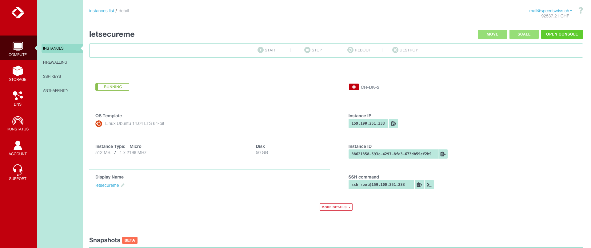
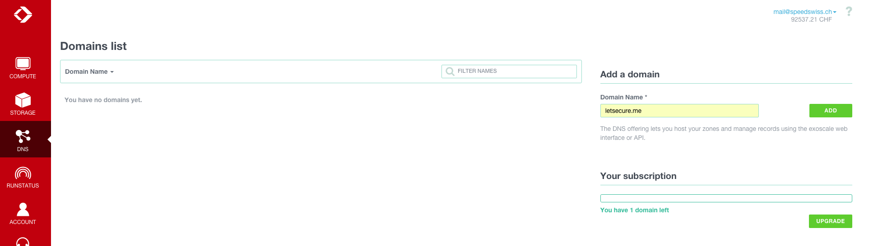
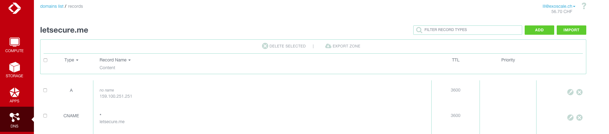
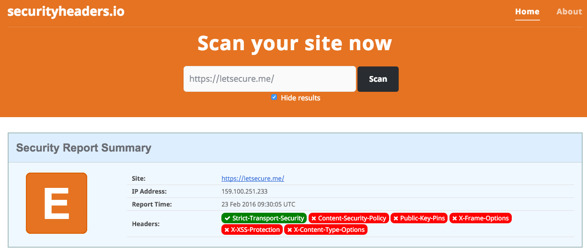
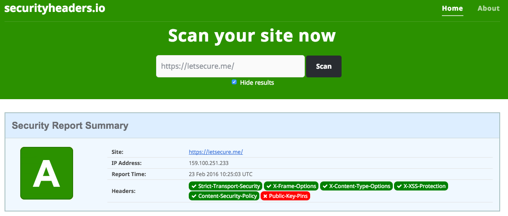

# State of the art secured web deployment using Let's Encrypt & Nginx

In this post we're going to outline how to secure a website using a Let's Encrypt certificate on top of Nginx, our webserver flavour of choice here at [Exsocale](https://www.exoscale.ch).

Let's Encrypt is a new Certificate authority which have the advantage to be free (!), open source and can be fully automated. Let's Encrypt root certificate is also trusted by most [browsers](https://community.letsencrypt.org/t/which-browsers-and-operating-systems-support-lets-encrypt/4394).

Before starting, below are a few caveats regarding Let's Encrypt for which not everybody may be comfortable with:

* It's still in beta phase
* It requires root privileges
* It installs a few dependencies (like [Augeas](http://augeas.net/), [gcc](https://gcc.gnu.org/), [Python](https://www.python.org/))
* Throttling is enforced so you cannot request more than 5 certificates per week for a given domain
* Certificate is valid for 90 days

It's possible get a certificate using [alternate and more lightweight clients](https://community.letsencrypt.org/t/list-of-client-implementations/2103) however we won't cover them in this post.

Our main goal for today is to get the best ranking (A+) on the famous [Qualys SSL test suite](https://www.ssllabs.com/ssltest/).

## Initial setup

First we begin by spawning a new instance within the [Exoscale portal](https://portal.exoscale.ch). We choose a standard Ubuntu 14.04 flavour. For our demo a micro instance (512mb RAM, 1 Vcpu & 10GB disk) will be more than enough.

Within a few seconds our instance is available and ready for setup:



We take note of it's IP address so we can proceed with the DNS setup. Luckily DNS zone hosting is only a click away within the management portal:



We create our zone "letsecure.me".

_N.B Put here your own zone name_

Now we add a A record with the value of the ip address of our freshly spawned instance as well as a "catch all" (wildcard) CNAME record:



We're done with the DNS, don't forget to update the nameservers of your domain with the ones below:

* ns1.exoscale.com
* ns1.exoscale.ch
* ns1.exoscale.net
* ns1.exoscale.io

This change must be done from within your domain registrar administration console.

Let's go back to our instance. Before beginning with the setup, we're going to apply a few elementary security best practices:

On the [firewall](https://portal.exoscale.ch/compute/firewalling) side, we allow only the required traffic by adding the below rules:

* 22 (SSH)
* 80 (HTTP)
* 443 (HTTPS)
* ICMP ping (not mandatory but convenient)

Our firewall is now configured, we can now we log on using the root account and our [SSH key](https://wiki.archlinux.org/index.php/SSH_keys). This isn't mandatory but highly recommended (did we said highly ?). Standard user / password is also supported.

The first thing we do is to apply all the security (and non security) updates and reboot the instance with the following commands:

```
apt-get update && apt-get dist-upgrade -y && reboot
```

We log back in and enable the automatic security updates:

```
dpkg-reconfigure --priority=low unattended-upgrades
```

Looks good so far. If you're using SSH key authentication, __and only if so !__, you may also disable the SSH password authentication:

```
sed -i 's|PasswordAuthentication yes|PasswordAuthentication no|g' /etc/ssh/sshd_config
service ssh restart
```

If you're not using SSH key authentication, we suggest to install fail2ban to prevent brute force SSH attacks:

```
apt-get install -y fail2ban
```

## Nginx Setup

Now we'll take care of Nginx. We're not going to install the package from the Ubuntu repository as we require features (like HTTTP2) that can only be found in the latest "mainline" release branch. We add then the Nginx official repository using:

```
wget http://nginx.org/keys/nginx_signing.key && sudo apt-key add nginx_signing.key && rm nginx_signing.key
echo "deb http://nginx.org/packages/mainline/ubuntu/ trusty nginx" > /etc/apt/sources.list.d/nginx_org_packages_mainline_ubuntu.list
apt-get update && apt-get install -y nginx
``` 

We create the target folder from where our wesite will be served:

````
mkdir /var/www/
wget tar from repo
tar -xvf /var/www/
chown -R www-data /var/www/
````

Remove Nginx default configuration:

```
rm /etc/nginx/conf.d/default.conf
touch /etc/nginx/conf.d/default.conf
```

And add the following Nginx configuration block in /etc/nginx/conf.d/default.conf so Let's Encrypt client can create temporary files required to authenticate the domain for which we're requesting the certificate for :


```
server {
    listen 80;
    server_name letsecure.me www.letsecure.me;
    root /var/www/demo;
    location /.well-known/acme-challenge {
        default_type "text/plain";
    }
}
```

_N.B Put your own domain in server_name_

and we reload Nginx to apply our configuration change:

```
nginx -t &&  nginx -s reload
```

## Let's Encrypt setup

We're done with Nginx for the time being. Go for Let's Encrypt, we're going to clone it's [GIT](https://github.com/letsencrypt/letsencrypt) repository:

```
apt-get install -y git
git clone https://github.com/letsencrypt/letsencrypt /opt/letsencrypt
cd /opt/letsencrypt
./letsencrypt-auto
```

Note that all the required dependencies are being installed automatically by the setup script.

Now we request our certificate:

```
export DOMAINS="letsecure.me,www.letsecure.me"
export DIR=/var/www/demo
./letsencrypt-auto certonly --server https://acme-v01.api.letsencrypt.org/directory -a webroot --webroot-path=$DIR -d $DOMAINS
nginx -t && nginx -s reload
```

_N.B Put your own domain in the DOMAINS list_

You'll get prompted to provide your email address for the expiring notifications.

And finally our cert has been delivered !

```
output text here
```

We add the following minimal Nginx configuration block so our website get served over HTTPS:

```
server {
    listen 443 ssl;
    server_name letsecure.me www.letsecure.me;
    root /var/www/demo;
    ssl_certificate /etc/letsencrypt/live/letsecure.me/fullchain.pem;
    ssl_certificate_key /etc/letsencrypt/live/letsecure.me/privkey.pem;
}
```

Let's reload nginx one more time:

```
nginx -t &&  nginx -s reload
```

Now Point your web browser to https://YOURDOMAINHERE

The homepage should display over HTTPS \O/ 

We need to ensure that our certificate, which is valid for 90 days only, get renewed automatically. We're going to use a small script and a crontab for this purpose:

```
export DOMAINS="letsecure.me,www.letsecure.me"
export DIR=/var/www/demo
./letsencrypt-auto --renew certonly --server https://acme-v01.api.letsencrypt.org/directory -a webroot --webroot-path=$DIR -d $DOMAINS
service nginx reload
```

One of the goal of this post is to get the best ranking with the Qualyss SSL test. So let's check it: https://www.ssllabs.com/ssltest/analyze.html

Hmmm not so good. Let's pimp a bit our nginx config:

## Nginx config optimization


```
server {
 listen 80;
 listen 443 ssl http2;
 server_name letsecure.me www.letsecure.me;
 ssl_protocols TLSv1 TLSv1.1 TLSv1.2;
 ssl_ciphers EECDH+AES128:RSA+AES128:EECDH+AES256:RSA+AES256:EECDH+3DES:RSA+3DES:!MD5;
 ssl_prefer_server_ciphers On;
 ssl_certificate /etc/letsencrypt/live/www.letsecure.me/fullchain.pem;
 ssl_certificate_key /etc/letsencrypt/live/www.letsecure.me/privkey.pem;
 ssl_session_cache shared:SSL:128m;
 add_header Strict-Transport-Security "max-age=31557600; includeSubDomains";
 ssl_stapling on;
 ssl_stapling_verify on;
 resolver 8.8.8.8;
 root /var/www/demo;
 index index.html;

 location '/.well-known/acme-challenge' {
  default_type "text/plain";
    root        /var/www/demo;
  }

 location / {
          if ($scheme = http) {
            return 301 https://$server_name$request_uri;
          }
 }
}

```

Let's review some important config items that we've just added:

```
listen 443 ssl http2;
```

With this directive, we tell Nginx to listen over SSL and also support the connection over the new [HTTP2](https://en.wikipedia.org/wiki/HTTP/2) standard, if the client browser support / request it. Please also note that HTTP2 is SSL only

```
ssl_protocols TLSv1 TLSv1.1 TLSv1.2;
```

We disable old and weak SSLv2 & V3 protocols and allow only the TLS ones.

```
 ssl_ciphers EECDH+AES128:RSA+AES128:EECDH+AES256:RSA+AES256:EECDH+3DES:RSA+3DES:!MD5;
 ssl_prefer_server_ciphers On;
```

This is the cipher list we support. This list is in our opinion one of the most well balanced between security and support by older web browsers. We also ask Nginx to prefer our ciphers over the ones requested by the client.


```
 ssl_stapling on;
 ssl_stapling_verify on;
```

We enable OCSP stapling. OCSP stapling is well described in details [here](https://www.maxcdn.com/one/visual-glossary/ocsp-stapling/)


```
add_header Strict-Transport-Security "max-age=31557600; includeSubDomains";
```

Here we add a HTTP header instructing the client browser to force a HTTPS connection to our domain and __all our Subdomains__ for __1 year__. __Warning__ very be carefull here before applying it in production, you must ensure first that all your subdomains are being secured as well.

Let's re-test again our setup: https://www.ssllabs.com/ssltest/analyze.html:


Hey, this looks much better now ! Our setup is now secured using an optimal SSL configuration, our objective is met.

Now, what about the content / behaviour of our website ? [Scott Helme](https://securityheaders.io/about/) did create a great HTTP response headers [analyser](https://securityheaders.io/).

Let's get a step further and try to get a good ranking on this analyser as well. We try on our current setup and see that the result is... not so good:



Again let's tune a bit our configuration by adding a few HTTP headers:

```
add_header X-Content-Type-Options "nosniff" always;
```

The [X-Content-Type-Options](https://scotthelme.co.uk/hardening-your-http-response-headers/#x-content-type-options) header stops a browser from trying to MIME-sniff the content type and forces it to stick with the declared content-type.

```
add_header X-Frame-Options "SAMEORIGIN" always;
```

The [X-Frame-Options](https://scotthelme.co.uk/hardening-your-http-response-headers/#x-frame-options) header tells the browser whether you want to allow your site to be framed or not. By preventing a browser from framing your site you can defend against attacks like clickjacking.

```
add_header X-Xss-Protection "1";

```

The [X-Xss-Protection](https://scotthelme.co.uk/hardening-your-http-response-headers/#x-xss-protection) header sets the configuration for the cross-site scripting filter built into most browsers.

```
add_header Content-Security-Policy "default-src 'self'";
```

The Content-Security-Policy header defines approved sources of content that the browser may load. It can be an effective countermeasure to Cross Site Scripting (XSS) attacks. __WARNING__ this header must be carefully planned before deploying it on production website as it could easily break stuff and prevent a website to load it's content ! Fortunately there is a "report mode" available where the browser will report any issue in the debug console but not actually block any content. This is very helpful to ensure a smooth deployement of this header:


The configuration of this policy is well described [here](https://scotthelme.co.uk/content-security-policy-an-introduction/)

The report mode can be enabled using:

```
Content-Security-Policy-Report-Only instead of Content-Security-Policy
```

Let's reload Nginx one more time to apply our new headers:

```
nginx -t && nginx -s reload
```

And scan again our site using https://securityheaders.io/:

_N.B ensure to test using HTTPS_



"A" grade, much better ! Some of you may have noticied that we didn't enable HPKP (HTTP Public Key Pinning), which will allow to get the A+ grade. In fact we skipped that header as it could really screw your website if the feature is not well understood and carefully planned. This header will be covered in another detailed blog post.

So Our final Nginx configuration looks like:

```
post here
```

and can be downloaded directly from [here](link)

** Summary

Let's Encrypt can be easilly deployed and maintened on top of Nginx. Specific SSL and browser hardening must be deployed in order to ensure a modern and secure web deployement.

** Try it yourelf!

Call to action 
